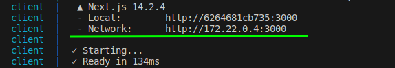

###  APP registro de Clientes

Esse é um app completo com tudo que pede o sistema proposto, o sistema está completamente dockerizado basta apenas ter o Doceker >=26.1.3 e Docker Compose instalado em sua máquina. após a instalação deles, basta executar 

docker compose  up --build

Esse comando baixará todas as dependecias do projeto e configurará todo sistema de desenvolvimento automaticamente.
no seu terminal será mostrado os Logs fique atento pois o container client mostrará onde sua aplicação foi iniciada:

exemplo:

A imagem mostra a url da aplicação
Para acessar o sistema é necessário entrar com:
email:
admin@admin.com
password:
admin

O backend possui alguns teste de rotas com jest:
que são divididas em 

/user
/client

apenas a rota de singin não possui verificação de auteniticação o restante das rotas do crud precisam de um token de acesso retornado pelo própio singin

O projeto foi dividido em client e sever, o Banco é um container mysql. A parte client foi contruída com next14, e o server em nodejs com Prisma ORM. tanto server quando o client foi ultilizado typescript.